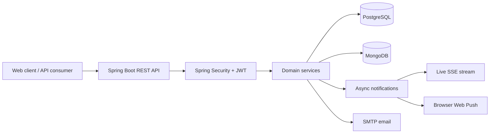

<div align="center">

# 🏡 FamilyHub

### A little less chaos. A little more together.

A Java & Spring Boot backend for the everyday things families share:<br>
plans, chores, budgets, and reminders.


[Features](#-what-familyhub-does) · [Architecture](#-under-the-hood) · [Run locally](#-run-locally) · [API guide](#-explore-the-api)

</div>

---

## 🌷 About the project

> 🚧 **Work in progress:** FamilyHub is under active development, with major optimisation and design updates being developed to improve performance, maintainability, and the overall experience. Planned additions include Kafka, Redis, an improved notification system, multi-day events, and third-party login.

Family life comes with a lot of small things to remember. FamilyHub brings them into one shared space, with personal profiles and family groups connecting the experience.

This repository contains the **backend API**. It combines relational account data with document-based family features, JWT authentication, recurring calendar events, and asynchronous notifications.

## ✨ What FamilyHub does

| Feature | What it supports |
| --- | --- |
| 🔐 Accounts | Registration, email confirmation, login, and access/refresh tokens |
| 🏡 Family groups | Create a family, join with a time-limited invite code, manage membership, and view members |
| 🌼 Personal profiles | Names, birthdays, gender, and avatar URLs |
| ✅ Shared tasks | Task lists with participants, task editing, and completion tracking |
| 💸 Family budgets | Income and expense transactions, multiple currencies, and nested sub-budgets |
| 🗓️ Shared calendar | All-day and timed events, participants, daily/weekly/monthly/yearly recurrence, and occurrence queries within a date range |
| 🔔 Notifications | Live Server-Sent Events, paginated history, read tracking, browser Web Push, and scheduled event reminders |
| 🌸 Cycle tracking | Period records, history-based predictions, monthly summaries, and configurable family visibility |

## 🧩 Under the hood



| Layer | Technology / responsibility |
| --- | --- |
| Runtime | Java 17, Spring Boot 3.4.0, Gradle wrapper |
| API | Spring MVC, Jakarta Validation, OpenAPI / Swagger UI |
| Authentication | Spring Security, HS256 JWTs, BCrypt passwords, HttpOnly token cookies, bearer-header support |
| Relational storage | PostgreSQL with Spring Data JPA for accounts, personas, families, invites, and push subscriptions |
| Document storage | MongoDB with Spring Data MongoDB for tasks, budgets, calendar events, notifications, and cycle data |
| Background work | Spring async executors and scheduled reminders |
| Delivery | SSE, VAPID Web Push, and SMTP email |
| Diagnostics | Request correlation IDs and centralized `ApiError` responses |
| Tests | JUnit 5, Mockito, and an H2-backed application context test |

### Engineering highlights

- **Recurring events:** store a recurrence rule and expand occurrences for a requested time window, with interval, end date/count, weekday, and month-day options.
- **Multiple persistence models:** keep account and membership relationships in PostgreSQL, with feature documents in MongoDB. Services coordinate access across both stores.
- **Asynchronous delivery:** persist notifications and deliver live updates through SSE and Web Push using a notification executor.
- **Browser authentication:** support HttpOnly JWT cookies and bearer headers, with CSRF protection on routes outside `/auth/**` and configurable CORS origins.
- **Debuggable errors:** attach correlation IDs to request logs and return consistent API error bodies with reference IDs.

Browse the [controllers](src/main/java/com/visnevschi/familyhub/controller), [services](src/main/java/com/visnevschi/familyhub/service), and [tests](src/test/java/com/visnevschi/familyhub) for the implementation.

## 🌱 Run locally

### 1. Prepare your tools and databases

Install **JDK 17**, **PostgreSQL**, and **MongoDB**. The Gradle wrapper is included.

Create a PostgreSQL database named `familyhub`, and start MongoDB locally. Hibernate creates or updates the SQL tables on startup; MongoDB automatic index creation is enabled.

### 2. Configure the application

The defaults live in [application.properties](src/main/resources/application.properties). Override them with environment variables:

| Variable | Local example / purpose |
| --- | --- |
| `SPRING_DATASOURCE_URL` | `jdbc:postgresql://localhost:5432/familyhub` |
| `SPRING_DATASOURCE_USERNAME` | `postgres` |
| `SPRING_DATASOURCE_PASSWORD` | Your local PostgreSQL password |
| `SPRING_DATA_MONGODB_URI` | `mongodb://localhost:27017/FamilyHub` |
| `APP_JWT_SECRET` | A random secret of at least 32 UTF-8 bytes; used directly, without Base64 decoding |
| `APP_JWT_COOKIE_SECURE` | `false` for local HTTP; use `true` with HTTPS |
| `SPRING_MAIL_USERNAME` | Gmail address for confirmation emails |
| `SPRING_MAIL_PASSWORD` | Gmail app password |
| `SPRING_MAIL_FROM` | Sender address |
| `APP_CORS_ALLOWED_ORIGINS` | Your frontend origin; localhost ports 3000, 5173, and 4200 are already allowed |

Email credentials are needed to exercise account registration and confirmation. Set `SPRING_MAIL_HOST` and `SPRING_MAIL_PORT` if using another SMTP provider.

For browser push, also configure `VAPID_PUBLIC_KEY`, `VAPID_PRIVATE_KEY`, and `VAPID_SUBJECT`. Without keys, Web Push is disabled; the API can still start. Browser delivery also requires a frontend service worker and subscription. Key-generation notes are in `application.properties`.

Example environment setup in PowerShell:

```powershell
$env:SPRING_DATASOURCE_PASSWORD = 'your-local-db-password'
$env:APP_JWT_SECRET = 'replace-with-your-own-random-secret-of-at-least-32-bytes'
$env:APP_JWT_COOKIE_SECURE = 'false'
$env:SPRING_MAIL_USERNAME = 'your-email@gmail.com'
$env:SPRING_MAIL_PASSWORD = 'your-app-password'
$env:SPRING_MAIL_FROM = 'your-email@gmail.com'
```

### 3. Start the backend

macOS / Linux:

```bash
./gradlew bootRun
```

Windows PowerShell:

```powershell
.\gradlew.bat bootRun
```

Open [Swagger UI](http://localhost:8080/swagger-ui/index.html) to explore request and response schemas. The OpenAPI document is available at [`/v3/api-docs`](http://localhost:8080/v3/api-docs).

## 🗺️ Explore the API

A typical flow is: **register → confirm email → log in → create a persona → create or join a family → use shared features**.

Representative routes below match the current controllers. Swagger contains the full API schema.

| Area | Example routes |
| --- | --- |
| Authentication | `POST /auth/register`, `POST /auth/confirm`, `POST /auth/login`, `POST /auth/refresh` |
| Persona | `GET /personas/me`, `POST /personas/me`, `PATCH /personas/me` |
| Family | `POST /families`, `POST /families/join`, `POST /families/me/join-code`, `GET /families/me/members` |
| Tasks | `GET /tasks/getLists`, `POST /tasks/createList`, `POST /tasks`, `PATCH /tasks`, `DELETE /tasks` |
| Budgets | `GET /budgets`, `POST /budgets`, `POST /budgets/{budgetId}/transaction` |
| Calendar | `GET /calendar`, `POST /calendar`, `PATCH /calendar/{eventId}`, `GET /calendar/occurrences?start=…&end=…` |
| Notifications | `GET /notifications`, `PATCH /notifications/{notificationId}/read`, `GET /notifications/stream` |
| Browser push | `POST /push/subscriptions`, `DELETE /push/subscriptions`, `GET /push/subscriptions/me` |
| Cycle tracking | `POST /personas/me/period-profile`, `POST /personas/me/period-profile/start`, `GET /personas/me/period-profile/records/month` |

Access tokens expire after **1 hour**, refresh tokens after **30 days**, and family join codes after **15 minutes** by default. For protected write requests, send the CSRF token as well as your authentication token.

## 🧪 Tests

```bash
./gradlew test
```

On Windows, use `.\gradlew.bat test`. Gradle writes the HTML report to `build/reports/tests/test/index.html`.

The current suite includes calendar recurrence regression tests, period-profile service tests, and an application context smoke test. These are focused checks; they do not cover every endpoint or live notification integration.

## 🚧 Next steps

The following additions are planned as part of the ongoing optimisation and design work:

- Kafka integration for event-driven processing
- Redis integration for caching
- An improved notification system
- Multi-day calendar events
- Third-party login with OAuth 2.0 / OpenID Connect
- Secure in-app chat
- Broader API and integration test coverage
- Versioned database migrations in place of Hibernate schema updates

Before deploying, provide an environment-specific JWT secret, enable secure cookies over HTTPS, configure your frontend origins, and choose an explicit schema/index migration strategy.

Development conventions are in [DEVELOPMENT_WORKFLOW.md](DEVELOPMENT_WORKFLOW.md).

---

<div align="center">

🌷 Built around the small things that make a home run smoothly.

</div>
